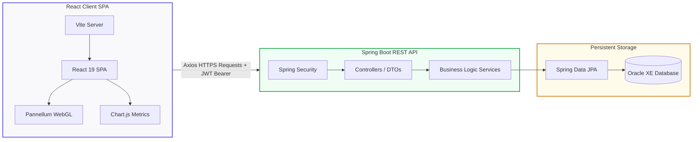
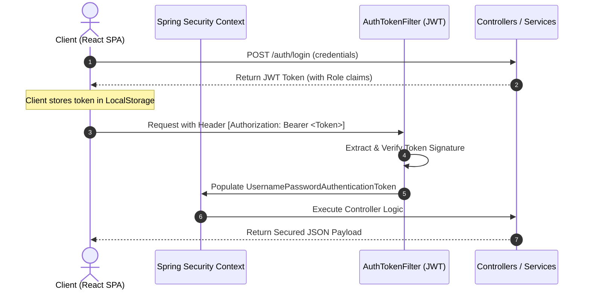

# 🏢 ReserveHub Application

> **Immersive 360° Workspace & Resource Booking Platform**
> 
> A enterprise-grade workspace scheduling and resource reservation application. It combines a robust **Spring Boot REST API** with a responsive **React SPA**, backed by an **Oracle Database**, featuring an immersive WebGL-powered 360° interactive room walkthrough.

---

<p align="center">
  
  
  
  
  
  
</p>

---

## 🌟 Standout Capabilities

### 👁️ Virtual Interactive Previews
*   **360° Room Panoramas**: Implemented via [RoomPanorama.jsx](file:///e:/Resume%20Projects/Capstone-project/Capstone-project/Resource_Booking/frontend/src/components/RoomPanorama.jsx) utilizing **WebGL** and **Pannellum** to give users a fully interactive virtual walkthrough of conference rooms and workspaces.
*   **Feature Verification**: Inspect capacities, seating arrangements, and room layouts in VR before creating a reservation.

### 📅 Smart Scheduling & Optimization
*   **Slot-Based Scheduling**: Managed dynamically in [ResourceSlot.java](file:///e:/Resume%20Projects/Capstone-project/Capstone-project/Resource_Booking/backend/src/main/java/com/engage/resourcebooking/model/ResourceSlot.java) to coordinate bookings and eliminate overlaps.
*   **Maintenance Windows**: Prevent booking clashes during maintenance hours via [MaintenanceBlock.java](file:///e:/Resume%20Projects/Capstone-project/Capstone-project/Resource_Booking/backend/src/main/java/com/engage/resourcebooking/model/MaintenanceBlock.java).
*   **Buffer Time Management**: Configurable preparation buffers between bookings to accommodate setup changes.

### 🔒 Enterprise Governance & Security
*   **Manager Approval Workflows**: Built-in routing where bookings requesting restricted rooms (marked in [Room.java](file:///e:/Resume%20Projects/Capstone-project/Capstone-project/Resource_Booking/backend/src/main/java/com/engage/resourcebooking/model/Room.java)) automatically require manager review.
*   **Role-Based Access Control (RBAC)**: Fine-grained security for `Admin`, `Manager`, and `Employee` actions, secured under stateless JWT token validation in [WebSecurityConfig.java](file:///e:/Resume%20Projects/Capstone-project/Capstone-project/Resource_Booking/backend/src/main/java/com/engage/resourcebooking/security/WebSecurityConfig.java).
*   **Audit Logging**: Automatic change logs and historical records in [BookingAudit.java](file:///e:/Resume%20Projects/Capstone-project/Capstone-project/Resource_Booking/backend/src/main/java/com/engage/resourcebooking/model/BookingAudit.java).

---

## 🛠️ Technology Stack & Layering

### Architecture Blueprint


### Detailed Tech Stack Matrix

| Layer | Component | Core Technologies | Primary Responsibility |
| :--- | :--- | :--- | :--- |
| **Frontend** | Interactive Client | React 19, Axios, React Router, Vite | Client-side routing, state, and API communication. |
| **Visualizer** | 360° Walkthrough | WebGL, Pannellum | Rendering panoramic images with responsive pan/zoom controls. |
| **Analytics** | Statistics Engine | Chart.js, React-Chartjs-2 | Visualizing office capacity and booking analytics. |
| **Security** | Auth Gateway | Spring Security, JSON Web Tokens (JWT) | Stateless requests authentication and role-based route blocking. |
| **Backend** | API Services | Spring Boot 3.x, Spring Data JPA | Scheduling engines, validation layers, DTO mapping. |
| **Database** | Core Storage | Oracle DB (11g/12c/21c), H2 Dialect | Sequence generators, Oracle SQL triggers, relational constraints. |

---

## 📦 Directory Structure & Mapping

```
ReserveHub/
├── backend/                             # Spring Boot Backend
│   ├── src/main/java/com/engage/
│   │   └── resourcebooking/
│   │       ├── controller/              # Controllers exposing API endpoints
│   │       ├── dto/                     # Transfer objects representing JSON payloads
│   │       ├── model/                   # Hibernate Database Entities
│   │       ├── repository/              # Spring Data JPA JPA Query interfaces
│   │       ├── security/                # Spring Security context & JWT filter chains
│   │       └── service/                 # Booking scheduling logic & implementations
│   │
│   ├── src/main/resources/
│   │   └── application.properties       # Database credentials & server parameters
│   └── pom.xml                          # Maven build script
│
└── frontend/                            # React Frontend
    ├── src/
    │   ├── components/                  # Room cards, panoramas, global components
    │   ├── pages/                       # Dashboard, lists, admin/manager portals
    │   ├── App.jsx                      # Client router routing configurations
    │   └── main.jsx                     # Entry point mounting script
    │
    ├── package.json                     # NPM dependency registry
    └── vite.config.js                   # Vite server settings
```

---

## 🚀 Installation & Local Environment Setup

### 1. Database Provisioning
> [!IMPORTANT]
> The backend connects to an Oracle instance (`jdbc:oracle:thin:@localhost:1521:XE`). Ensure your Oracle DB is running.

Launch SQL Plus or developer tool and run:
```sql
CREATE USER engage IDENTIFIED BY engage;
GRANT CONNECT, RESOURCE, DBA TO engage;
```

---

### 2. Startup Backend API
1.  Navigate to the backend:
    ```bash
    cd backend
    ```
2.  Review your database credentials in [application.properties](file:///e:/Resume%20Projects/Capstone-project/Capstone-project/Resource_Booking/backend/src/main/resources/application.properties).
3.  Compile and build the artifacts:
    ```bash
    mvn clean install
    ```
4.  Launch the Spring Boot server:
    ```bash
    mvn spring-boot:run
    ```
    The server starts at `http://localhost:8000`.

---

### 3. Startup Frontend Client
1.  Navigate to the frontend:
    ```bash
    cd ../frontend
    ```
2.  Install packages:
    ```bash
    npm install
    ```
3.  Run the client application:
    ```bash
    npm run dev
    ```
    Access the UI at `http://localhost:5173`.

---

## 🔌 Core API Endpoints

| HTTP Method | Route | Auth Role Required | Description |
| :--- | :--- | :--- | :--- |
| `POST` | `/auth/login` | *Public* | Returns JWT token for users |
| `POST` | `/auth/register` | *Public* | Creates user details |
| `GET` | `/rooms` | `Employee`, `Manager`, `Admin` | Fetches available resources |
| `GET` | `/rooms/search` | `Employee`, `Manager`, `Admin` | Filters rooms by slots and date |
| `POST` | `/admin/rooms` | `Admin` | Registers a new workspace resource |
| `POST` | `/bookings` | `Employee`, `Manager`, `Admin` | Schedules a room request |
| `POST` | `/bookings/{id}/status` | `Manager`, `Admin` | Approves or rejects reservations |

---

## 🛡️ Security & Authentication Flow

ReserveHub implements stateless **JWT-based Security** for all API routes (except registration/login):



---

## 🗄️ Relational Database Schema

The persistence layer uses JPA and Hibernate to manage highly connected entities in Oracle Database:

*   **`User`**: Manages credentials, roles (`EMPLOYEE`, `MANAGER`, `ADMIN`), department association, and manager hierarchy relationships.
*   **`Room`**: Details workspace parameters, allowed roles, allowed departments, and maximum durations stored as dynamic JSON metadata fields.
*   **`ResourceSlot`**: Schedules specific daily operating slots (e.g., 9:00 AM - 10:00 AM) to optimize workspace utilization.
*   **`Booking`**: Intersects `User`, `Room`, and `ResourceSlot`. Includes status lifecycle stages (`PENDING`, `APPROVED`, `REJECTED`, `CANCELLED`).
*   **`MaintenanceBlock`**: Allows dynamic lockout intervals for rooms during repairs, excluding affected slots from search results.
*   **`BookingAudit` & `AuditLog`**: Automatic compliance tracking recording booking updates, timestamped actor IDs, and details of operations.

Something casual bayya
---
